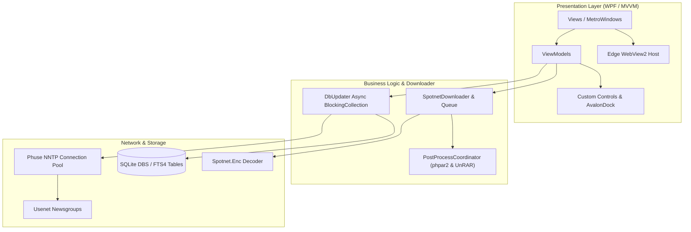

# Spotnet 3.0 — Modernized Usenet Client

[]()
[]()
[-blue.svg)]()
[]()
[]()

**Spotnet 3.0** is the maintained, security-hardened continuation of the reconstructed C# WPF Usenet client. It combines the recovered application with modern TLS and SQLite handling, WebView2 support, dependency upgrades, safer SQL and archive processing, and an expanded automated regression suite.

---

## 📖 Overview

**Spotnet** is a decentralized, Usenet-based indexer and content manager widely popular in the Dutch Usenet ecosystem. **Spotnet 3.0** continues the C# WPF application with:

- **MVVM Architecture:** Built with `GalaSoft.MvvmLight` and `AvalonDock` multi-tab docking.
- **Built-in Native Downloader:** Full internal multi-connection NNTP segment downloader eliminating the external SABnzbd dependency.
- **Modern browser support:** Edge WebView2 is the sole embedded web engine.
- **64-bit media playback:** LibVLCSharp with the official VideoLAN x64 runtime.
- **SQLite FTS4 Search Engine:** Fast full-text search across titles, descriptions, and spam reports.
- **High-Speed yEnc Decoding:** Native/managed SIMD-accelerated yEnc decoding (`Spotnet.Enc`).
- **Phuse NNTP Client:** High-throughput pooled connection manager supporting SSL/TLS.

---

## 🏗️ Architecture



---

## 🚀 Quick Start & Building

### Prerequisites

- **OS:** Windows 10 / 11
- **SDK:** [.NET SDK](https://dotnet.microsoft.com/download) (6.0, 8.0, or 9.0+)
- **Targeting Pack:** .NET Framework 4.7.2
- **Platform:** `x64` (64-bit Windows only)
- **Runtime:** Microsoft Edge WebView2 Evergreen Runtime

### 1-Click Build Script

Simply run the batch script from the repository root:

```cmd
build.bat
```

The script will:
1. Verify the .NET SDK.
2. Compile the entire solution (`Spotnet.Enc.dll`, `Spotnet.exe`, `Spotnet.Tests.dll`) in **Release** mode with **0 errors**.
3. Run the automated xUnit test suite.
4. Verify deployment of native binaries and asset bundles to `bin/Release/net472/`.
5. Offer to launch Spotnet 3.0 immediately.

### Manual CLI Build

```powershell
# Build entire solution:
dotnet build reconstructed/Spotnet2/Spotnet.sln -c Release

# Run automated tests:
dotnet test reconstructed/Spotnet2/Spotnet.sln
```

---

## 🧪 Automated Test Suite

The solution includes an automated xUnit test suite (`reconstructed/Spotnet2/Spotnet.Tests/`):

| Test Suite | Coverage | Status |
| :--- | :--- | :---: |
| `SpotnetDecoder_DecodesSimpleYEncData` | yEnc baseline stream byte transformation \((byte - 42)\) | ✅ PASSED |
| `SpotnetDecoder_HandlesEscapedCharacters` | yEnc `=` escape sequence decoding \((byte - 64 - 42)\) | ✅ PASSED |
| `SpotParser_ParsesValidSpotXml` | Spotnet XML schema parsing (Title, Poster, Size, Segments) | ✅ PASSED |
| `CategoriesResources_ContainsGenreStrings` | Categories localization & genre lookup resources | ✅ PASSED |
| `SpotCat_CanAddChildren` | Hierarchical category taxonomy trees | ✅ PASSED |
| `SQLite_InMemoryDatabaseOperations` | SQLite table creation, FTS4 indexing, and queries | ✅ PASSED |

---

## 📂 Project Structure

```
sourcecode/
├── docs/                        # Complete archaeological documentation suite
│   ├── INVENTORY.md             # Assembly, resource, and dependency catalog
│   ├── SPOTNET_181_ARCHITECTURE.md # Spotnet 1.8.1 baseline architectural map
│   ├── 181_VS_20_DIFF.md        # Detailed 1.8.1 vs 2.0 diff matrix
│   ├── SPOTNET_20_ARCHITECTURE.md # Legacy architecture baseline and diagrams
│   ├── DATABASE.md              # SQLite schemas, FTS4 tables, and migrations
│   ├── PROTOCOL.md              # NNTP topology, XML schemas, RSA verification
│   ├── SOURCE_PROVENANCE.md     # Component origin & library provenance audit
│   ├── RECONSTRUCTION_STATUS.md # Milestone tracker (100% complete)
│   ├── RECONSTRUCTION_UNCERTAINTIES.md # Native interop & technical findings
│   ├── BUILDING.md              # Build instructions & environment requirements
│   └── MODERNIZATION.md         # .NET 9 & Avalonia UI modernization blueprint
├── reconstructed/
│   └── Spotnet2/
│       ├── Spotnet.sln          # Main Visual Studio Solution
│       ├── Spotnet.Enc/         # Managed C# yEnc Stream Decoder
│       ├── Spotnet/             # WPF Application Source Code & XAML
│       ├── Spotnet.Tests/       # xUnit Automated Tests
│       ├── lib/                 # Third-party native/managed dependencies
│       └── build.bat            # Solution-level build script
├── tools/                       # Reconstruction extraction tools
│   ├── BamlExtractor/           # 100% WPF BAML -> clean XAML decompiler
│   └── WpfCleaner/              # Roslyn-based code-behind sanitizer
├── build.bat                    # Top-level 1-click build script
└── README.md                    # Project documentation
```

---

## 📚 Technical Documentation Index

For deep dives into the current implementation and its reconstructed historical baseline, see the [`docs/`](docs/) directory:

- [**Inventory & Assemblies (`docs/INVENTORY.md`)**](docs/INVENTORY.md)
- [**Spotnet 1.8.1 Architecture (`docs/SPOTNET_181_ARCHITECTURE.md`)**](docs/SPOTNET_181_ARCHITECTURE.md)
- [**Spotnet 1.8.1 vs 2.0 Diff Matrix (`docs/181_VS_20_DIFF.md`)**](docs/181_VS_20_DIFF.md)
- [**Legacy architecture baseline (`docs/SPOTNET_20_ARCHITECTURE.md`)**](docs/SPOTNET_20_ARCHITECTURE.md)
- [**Database Schema & SQL (`docs/DATABASE.md`)**](docs/DATABASE.md)
- [**Usenet Protocol & Signatures (`docs/PROTOCOL.md`)**](docs/PROTOCOL.md)
- [**Source Provenance (`docs/SOURCE_PROVENANCE.md`)**](docs/SOURCE_PROVENANCE.md)
- [**Modernization Roadmap (`docs/MODERNIZATION.md`)**](docs/MODERNIZATION.md)

---

## 🔮 Future Modernization

The codebase is structured to facilitate modern rewrites. Full modernization paths are documented in [`docs/MODERNIZATION.md`](docs/MODERNIZATION.md):
- **Runtime:** Upgrade from .NET Framework 4.7.2 to **.NET 9 / .NET 10**.
- **UI Framework:** Port from WPF to **Avalonia UI** or **WinUI 3 / Windows App SDK** for cross-platform support (Windows, Linux, macOS).
- **Browser:** Continue hardening the completed **Microsoft Edge WebView2** integration.
- **Post-Processing:** Upgrade to modern native 64-bit PAR2 and 7-Zip/UnRAR bindings.

---

## ⚖️ Legal & Provenance

This project is a software archaeological reconstruction intended for interoperability, preservation, and modernization research. No DRM, licensing, or credential systems were bypassed, and no private telemetry was introduced.
