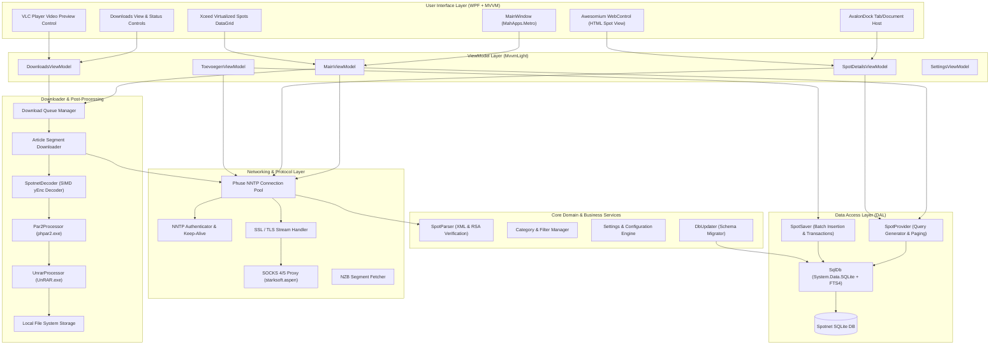

# Spotnet 2.0 Architectural Specification

**Product:** Spotnet 2.0 (Build 2.0.0.284)  
**Platform:** .NET Framework 4.5 / x86  
**Pattern:** MVVM (Model-View-ViewModel) with Dependency Injection / IoC  
**UI Engine:** WPF + MahApps.Metro + AvalonDock + Awesomium Chromium  

---

## 1. System Architecture Diagram

---

## 2. Layer & Subsystem Descriptions

### 2.1 Presentation Layer (`Spotnet.Views` & `Spotnet.Controls`)
- **`Spotnet.Views.MainWindow`**: Root window hosting the application menu, search toolbar, status footer, left-panel filter sidebar, and central docking workspace.
- **`Spotnet.Controls.LeftPanelUserControl`**: Tree view displaying hierarchical filters (Movies, Series, Music, Games, Applications, Books, Custom filters) with unread counters and badge icons.
- **`Spotnet.Controls.SpotsListWithDetailsGrid`**: Virtualized table displaying spot headers with thumbnail previews, poster ratings, file size, genre tags, and age.
- **`Spotnet.Browser.AwesomiumPage`**: Dedicated Chromium rendering surface for loading the HTML/CSS spot detail template, executing jQuery plugins, handling image zoom, and posting comments.
- **`Spotnet.Downloader.Controls.Player.PlayerControl`**: Embedded VLC player wrapper for streaming in-progress video downloads.

### 2.2 ViewModel Layer (`Spotnet.ViewModel`)
- Built on **MVVM Light** (`GalaSoft.MvvmLight`):
  - `MainViewModel`: Orchestrates spot retrieval, search keyword filtering, category selection, synchronization triggers, and status updates.
  - `SpotDetailsViewModel`: Manages single spot detail fetching, comments list loading, BBCode comment creation, NZB dispatching, and blacklist/spam reporting.
  - `DownloadsViewModel`: Controls download queue state (pause, resume, cancel, priority reordering, speed throttling).
  - `SettingsViewModel`: Persists Usenet server configurations, download folders, unpack options, and theme preferences.

### 2.3 Domain Model & Parsers (`Spotnet.Model`)
- **`Header`**: Lightweight representation of spot header retrieved via `XOVER`/`XHDR`.
- **`Spot`**: Comprehensive spot entity containing full XML description, poster details, timestamp, file size, image segment IDs, and embedded NZB segment list.
- **`Comment`**: User comment attached to a spot, including rating, avatar, timestamp, and poster signature.
- **`Filter`**: Hierarchical category filter definition with XML criteria rules.
- **`SpotParser`**: Parses spot XML payload, decrypts encoded keys, and validates cryptographic RSA signatures against `null_modulus.txt`.

### 2.4 Data Access Layer (`Spotnet.DAL`)
- **`SqlDb`**: SQLite database provider abstraction using `System.Data.SQLite`.
- **`SpotSaver`**: High-performance batch insertion pipeline that wraps incoming header/comment streams in SQLite transactions (batches of 1,000–5,000 records).
- **`SpotProvider`**: Dynamic SQL generator that constructs queries matching selected categories, subcategories, tags, posters, and text search strings with pagination support.
- **`DbUpdater`**: Automated schema migrator that applies incremental database updates on application launch.

### 2.5 Downloader & Post-Processing (`Spotnet.Downloader`)
- **`DownloaderEngine`**: In-process Usenet binary downloading engine.
- **Segment Worker Pool**: Spawns multiple parallel workers across configured download connections.
- **`SpotnetEnc.SpotnetDecoder`**: High-performance yEnc stream decoder that decodes Usenet binary articles directly to target file offsets.
- **`Par2Processor`**: Automatically launches `phpar2.exe` to verify parity blocks and repair damaged files.
- **`UnrarProcessor`**: Automatically extracts RAR/7z archives using `UnRAR.exe` or `7za.exe` with support for password list matching.

### 2.6 Deployment & Updates (`Spotnet.Deployment`)
- Managed by **Squirrel.Windows**:
  - Checks for background updates on application launch.
  - Downloads NuGet delta packages.
  - Migrates legacy ClickOnce registry and data files seamlessly.
